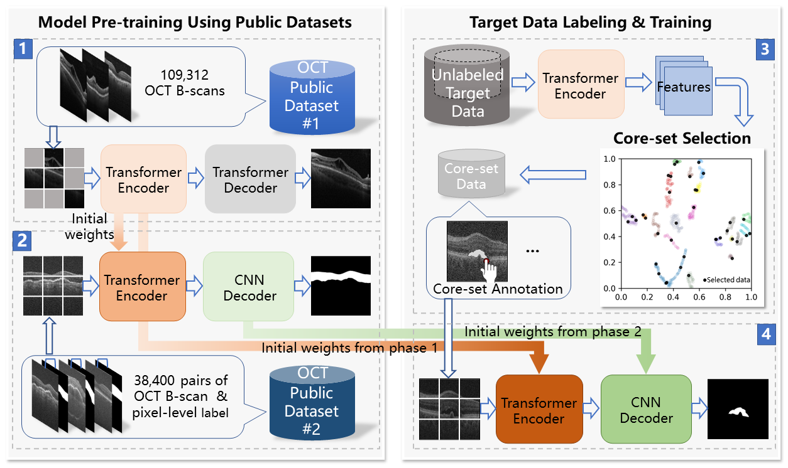

# Annotation-efficient-learning-for-OCT-segmentation

This repository contains the code for paper "Annotation-efficient learning for OCT segmentation". We propose an annotation-efficient learning method for OCT segmentation that could significantly reduce annotation costs and improve learning efficiency. Here we provide generative pre-trained transformer-based encoder and CNN-based segmentation decoder, both pretrained on open-access OCTdatasets. The proposed pre-trained model can be directly transfered to your ROI segmeantation based on OCT image. We hope this may help improve the intelligence and application penetration of OCT.

## Installing Dependencies 
python==3.8 
torch==1.11.1 
numpy==1.19.5 
monai==0.7.0 
timm==0.3.2 
tensorboardX==2.1 
torchvision==0.12.0 
opencv-python==4.5.5 
